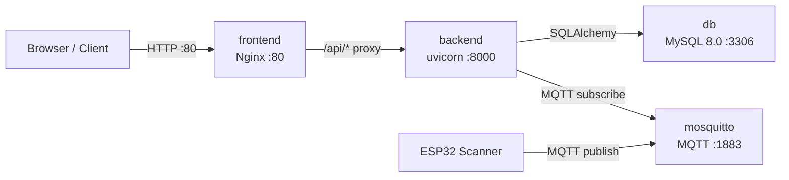

# ERSIS – Complete Docker Setup Guide

---

## 1. Project Analysis Results

Before writing a single Docker file, here is what was discovered:

| Layer | Technology | Version / Detail |
|---|---|---|
| **Backend framework** | FastAPI | ≥ 0.136.1 |
| **ASGI server** | Uvicorn (standard) | ≥ 0.46.0 |
| **Python runtime** | CPython | **3.13** (`.python-version`) |
| **Package manager** | `uv` | `pyproject.toml` + `uv.lock` |
| **Database** | **MySQL 8.0** | via `pymysql` + SQLAlchemy |
| **AI / Vector store** | FAISS + sentence-transformers | `faiss_indexes/` directory |
| **LLM provider** | Groq (external API) | key from `.env` |
| **IoT broker** | **MQTT / Mosquitto** | `MQTT_BROKER_HOST=mosquitto` (already named!) |
| **Frontend framework** | React 18 + **Vite 5** | `frontend-web/` |
| **CSS** | Tailwind CSS v3 | PostCSS pipeline |
| **Mobile app** | Expo / React Native | `frontend-mobile/myApp/` — **not containerised** |
| **Dev start commands** | `uvicorn app.main:app --reload` / `npm run dev` | |
| **Prod start command** | `uvicorn app.main:app` | |
| **CORS origins** | hardcoded list in `config.py` | localhost 3000, 5173, 5174… |

**Key observations:**
- `MQTT_BROKER_HOST` in the real `.env` was already `mosquitto` — the developer anticipated Docker.
- `FAISS_INDEX_DIR=faiss_indexes` is a relative path; inside Docker it resolves to `/app/faiss_indexes` — handled with a named volume.
- `config.py` used `env_file=str` (not a list); pydantic-settings v2 crashes when the file is missing. Fixed to `env_file=[...]` (list form is silently ignored if missing).
- Vite's proxy pointed hard-coded to `127.0.0.1:8000` — won't resolve inside Docker. Fixed with `VITE_BACKEND_URL` env var.
- The React SPA needs an Nginx reverse proxy in production to handle client-side routing (`try_files`) and forward `/api/*`.

---

## 2. Files Generated & Where They Live

```
Enterprise-Retail-Strategic-Inventory-System/       ← project root
│
├── docker-compose.yml               ← PRODUCTION orchestration
├── docker-compose.dev.yml           ← DEVELOPMENT override (hot-reload)
├── .dockerignore                    ← root-level build context filter
├── .env.docker.example              ← template → copy to .env
│
├── mosquitto/
│   ├── mosquitto.conf               ← Mosquitto broker config
│   ├── data/.gitkeep
│   └── log/.gitkeep
│
├── backend/
│   ├── Dockerfile                   ← Multi-stage Python 3.13 image
│   └── .dockerignore
│
└── frontend-web/
    ├── Dockerfile                   ← Multi-stage Node 20 → Nginx image
    ├── nginx.conf                   ← SPA routing + /api proxy
    └── .dockerignore
```

**Modified existing files:**
- `frontend-web/vite.config.js` — added `host: '0.0.0.0'` and `VITE_BACKEND_URL` support
- `backend/app/core/config.py` — `env_file` changed from `str` → `[list]` (Docker-safe)
- `.gitignore` — added Docker runtime dirs

---

## 3. Architecture: How Containers Interact



- All four services share the **`ersis-net` bridge network** — they talk by **service name** (Docker DNS), never `localhost`.
- The browser only ever hits port **80** (frontend). There is no exposed backend port in strict production (remove `8000:8000` mapping from `docker-compose.yml` when going live).
- MySQL data lives in the **`mysql-data`** named volume — survives container rebuilds.
- FAISS vector indexes live in **`faiss-indexes`** named volume — rebuilt once by the seed script, then reused.

---

## 4. Quick-Start Commands

### Step 1 — First-time setup

```bash
# From the project root
cp .env.docker.example .env
```

Edit `.env` and set at minimum:
```env
MYSQL_ROOT_PASSWORD=YourStrongPassword
GROQ_API_KEY=gsk_...your_key...
SMTP_USER=your@email.com
SMTP_PASSWORD=your-app-password
EMAIL_FROM=your@email.com
```

Also make sure `backend/.env` exists (copy from `backend/.env.example`):
```bash
cp backend/.env.example backend/.env
```
Edit `backend/.env` and set the same `GROQ_API_KEY`, `SMTP_*`, and `JWT_SECRET_KEY`.

---

### Step 2 — Build and start (PRODUCTION)

```bash
docker compose up -d --build
```

This single command:
1. Pulls `mysql:8.0`, `eclipse-mosquitto:2.0`, `python:3.13-slim`, `node:20-alpine`, `nginx:1.27-alpine`
2. Builds the backend image (uv installs all Python deps)
3. Builds the frontend image (npm + Vite build + Nginx)
4. Starts all 4 containers with health checks
5. App is available at **http://localhost**

---

### Step 3 — Seed the database (first run only)

After all containers are healthy:

```bash
docker compose exec backend python seed.py
```

> **Why `exec` and not a separate container?** The seed scripts need to import `app.*` modules, which in turn need the `.env` variables and a live DB connection — running inside the already-configured backend container is the simplest approach.

---

### Development Mode (hot-reload)

```bash
docker compose -f docker-compose.yml -f docker-compose.dev.yml up --build
```

| Service | URL | Hot-reload? |
|---|---|---|
| Frontend (Vite HMR) | http://localhost:5173 | ✅ Yes — any `.jsx/.js/.css` change |
| Backend API | http://localhost:8000 | ✅ Yes — any `.py` change |
| API Docs (Swagger) | http://localhost:8000/docs | — |
| MySQL | localhost:3306 | — |
| MQTT | localhost:1883 | — |

**How hot-reload works:**
- Backend: source code is bind-mounted (`./backend → /app`), uvicorn runs with `--reload`. The `.venv` inside the container is protected with an anonymous volume so it isn't overwritten by the host dir.
- Frontend: Vite dev server replaces Nginx entirely. Source is bind-mounted; `node_modules` inside the container is protected with an anonymous volume.

---

## 5. Production Deployment Workflow

```bash
# 1. Build fresh images
docker compose build --no-cache

# 2. Push to registry (if deploying to a server)
docker tag ersis-backend your-registry/ersis-backend:v1.0
docker tag ersis-frontend your-registry/ersis-frontend:v1.0
docker push your-registry/ersis-backend:v1.0
docker push your-registry/ersis-frontend:v1.0

# 3. On the server — pull and start
docker compose pull
docker compose up -d

# 4. Run seed only on first deploy
docker compose exec backend python seed.py
```

**Security checklist for production:**
- Remove `- "3306:3306"` from the `db` service (MySQL should not be exposed).
- Remove `- "8000:8000"` from the `backend` service (only Nginx should be public-facing).
- Set `DEBUG=false` in `backend/.env`.
- Use a strong `JWT_SECRET_KEY` and `MYSQL_ROOT_PASSWORD`.
- Consider adding `allow_anonymous false` + a password file in `mosquitto.conf`.

---

## 6. Useful Day-to-Day Commands

```bash
# View logs
docker compose logs -f backend
docker compose logs -f frontend
docker compose logs -f db

# Stop without deleting volumes
docker compose down

# Stop AND delete all data (fresh start)
docker compose down -v

# Rebuild only one service (e.g., after adding a Python package)
docker compose up -d --build backend

# Open a shell inside the backend container
docker compose exec backend bash

# Run a one-off Python script
docker compose exec backend python seed_products.py

# Inspect MySQL directly
docker compose exec db mysql -u root -ppassword ersis
```

---

## 7. Explanation of Every Docker Choice

### `backend/Dockerfile` — Multi-stage with `uv`
| Choice | Why |
|---|---|
| `python:3.13-slim` | Matches `.python-version`; `-slim` removes unnecessary apt packages → smaller image |
| Multi-stage build | Builder stage installs uv + deps; final stage only copies the `.venv` — build tools never enter the runtime image |
| `uv sync --frozen --no-dev` | `--frozen` enforces `uv.lock` (reproducible); `--no-dev` skips test-only packages |
| Non-root `ersis` user | Security best practice — process doesn't run as root |
| `PYTHONUNBUFFERED=1` | Log output appears immediately in `docker logs` |
| `/health` healthcheck | FastAPI already exposes `GET /health` — no extra code needed |

### `frontend-web/Dockerfile` — Node builder + Nginx runtime
| Choice | Why |
|---|---|
| `node:20-alpine` builder | LTS Node; Alpine keeps the builder small |
| `npm ci` (not `npm install`) | `ci` uses `package-lock.json` exactly — reproducible, faster |
| Vite build args | Vite inlines `VITE_*` variables at compile time; they must be set at **build** time, not runtime |
| `nginx:1.27-alpine` final | ~25 MB — far smaller than keeping Node in the image |
| `nginx.conf` with `try_files` | React Router requires this or every hard-refresh returns 404 |
| `/api/` proxy in Nginx | Replaces Vite's dev-server proxy for production |

### `docker-compose.yml`
| Choice | Why |
|---|---|
| `depends_on` with `condition: service_healthy` | Backend waits for MySQL to actually accept connections, not just start the process |
| `mysql-data` named volume | Data persists across `docker compose down`; only `down -v` deletes it |
| `DATABASE_URL` override in `environment:` | Overrides the localhost URL in `backend/.env` with `db` (Docker service name) |
| MQTT `mosquitto` service name | Matches `MQTT_BROKER_HOST=mosquitto` already in `.env` — zero config change |

---

## 8. Troubleshooting

| Problem | Solution |
|---|---|
| `backend` exits immediately on start | `docker compose logs backend` — usually a missing env var. Ensure `backend/.env` exists and has all required keys. |
| `db` health check keeps failing | Wait 30–60s on first run (MySQL initialises the data directory). Try `docker compose logs db`. |
| `FAISS` index not found error | Run the seed script: `docker compose exec backend python seed.py` |
| Frontend shows blank page | Check browser console for 404s. Ensure `nginx.conf` `try_files` is in place. Rebuild: `docker compose up -d --build frontend`. |
| Hot-reload not working (dev) | Confirm you used `-f docker-compose.dev.yml`. On Windows, Docker Desktop must have **file sharing** enabled for the project directory. |
| Port 80 already in use | Another service (IIS, nginx, Apache) is on port 80. Change `"80:80"` to e.g. `"8080:80"` in the frontend service. |
| `uv sync` fails in Docker build | The `uv.lock` may be outdated. Run `uv lock` locally then re-commit `uv.lock`. |
| Can't connect to MySQL from host | Port 3306 is mapped. Use `root` / your `MYSQL_ROOT_PASSWORD` / host `127.0.0.1`. |
| `sentence-transformers` slow first load | It downloads the model on first use. In production, pre-download via `docker compose exec backend python -c "from sentence_transformers import SentenceTransformer; SentenceTransformer('all-MiniLM-L6-v2')"` |
