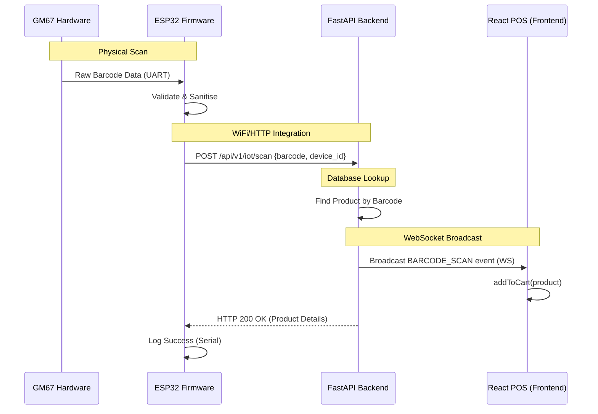

# ERSIS IoT System Integration Guide

The ESP32 Barcode Scanner is now fully integrated into the ERSIS ecosystem. This guide explains how the hardware, backend, and frontend communicate to provide a seamless "Scan-to-Cart" experience.

---

## 1. System Data Flow



---

## 2. Integrated Components

### 🛰️ ESP32 Firmware (WiFi + HTTP)
The firmware now includes `WifiManager` and `HttpClient`.
- **WiFi Watchdog:** Automatically reconnects if the signal drops.
- **REST Client:** Sends every valid scan to the central API.
- **Offline Fallback:** Continues to work via USB Serial even if WiFi is disconnected.

### 🔌 Backend Router (`app/routers/scanner.py`)
A dedicated IoT router handles the heavy lifting.
- **WebSocket Manager:** Tracks active cashier sessions and broadcasts scans to the correct store.
- **Device Registry:** Tracks the "Last Seen" timestamp, IP address, and signal strength of every connected scanner.
- **Secret Key Auth:** Uses `X-IoT-Secret` to ensure only authorised devices can post scans.

### 🛒 Frontend Hook (`hooks/useScannerSocket.js`)
The `useScannerSocket` hook provides a reactive interface for the POS.
- **Auto-Reconnect:** Transparently handles WebSocket drops.
- **Cart Integration:** Passes scanned product objects directly to the cashier context.
- **Status Reporting:** Returns the current connection state (`connected`, `connecting`, `disconnected`).

---

## 3. How to Verify the Connection

### 1. Backend Logs
When a scan is received, you should see the following in your FastAPI logs:
```text
INFO: app.routers.scanner: Scan OK: barcode=5901234123457 product='Coca-Cola' store=1 ws_clients=1
```

### 2. POS Interface
Open the **POS** page. You will see a status badge in the header:
- 🟢 **IoT Scanner: Connected** (Ready for scans)
- 🟡 **IoT Scanner: Connecting** (Checking backend)
- 🔴 **IoT Scanner: Disconnected** (Backend unreachable)

### 3. IoT Dashboard
Navigate to **Settings > IoT Devices**. The page now displays live data:
- **Device Name:** Auto-detected based on ID.
- **Last Seen:** Real-time timestamp from the heartbeat.
- **Signal Strength:** Calculated from the ESP32's RSSI.
- **Total Scans:** A lifetime counter per session.

---

## 4. Production Configuration

### Changing the IoT Secret
To change the security key, update both the backend and the firmware:
1. **Backend:** Change `IOT_DEVICE_SECRET` in your `.env` file.
2. **Firmware:** Update `IOT_DEVICE_SECRET` in `Config.h` or as a build flag in `platformio.ini`.

### Setting the API URL
Ensure the ESP32 points to your local server IP (not `localhost`):
```cpp
// include/Config.h
#define API_BASE_URL "http://192.168.1.100:8000" // Replace with your PC IP
```
